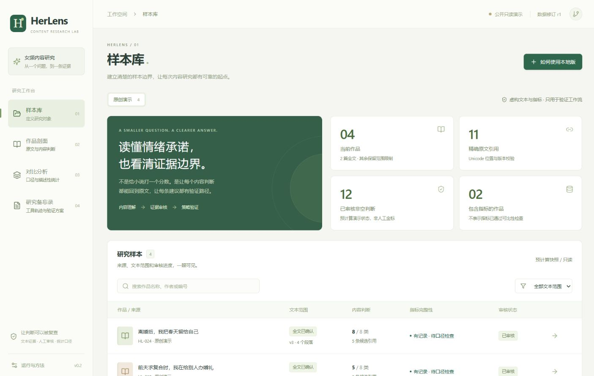
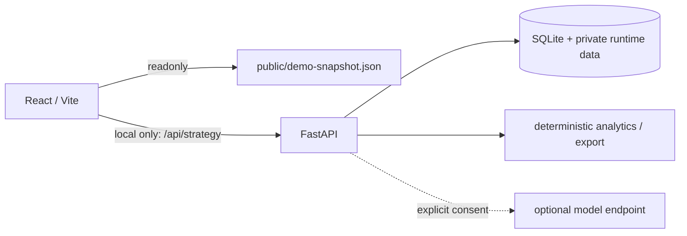

# HerLens｜女频小说内容策略工作台

HerLens 把“标题／导语承诺了什么情绪”与开篇、结尾的原文证据连起来，再在指标口径可比时做描述性分析。产出是可复核的内容标签、证据链和下一步验证方案，不是“爆款预测”或自动文学评分。

**适用范围不按篇幅划分。**所有小说沿用同一套内容、证据和审核方法；区别来自实际提供的文本范围（只有标题导语、只有开篇、或已确认完整全文），而不是“长篇／短篇”产品边界。Web 交互导入仍有 512 KiB 的资源上限；大文件使用独立的全文分块分析命令，结果保存在本地，尚不自动接入 Web 样本库。

> 当前公开演示使用 4 篇标记为“原创虚构演示”的预计算夹具。演示指标只用于验证交互与计算，不代表真实平台、用户或市场结论；不包含用户作品、平台内部数据或模型密钥。



## 现在可以演示什么

- 「样本库」：检查文本覆盖、使用边界、指标可用性与审核状态。
- 「作品剖面」：检查八类特征，点击结论回到标题、导语、开篇或结尾的精确原句。
- 人工修订标签后，相关图表与备忘录会标记为过期；重算后记录新修订版本。
- 「对比分析」：查看去重的标签频数和同口径 CTR，并查看样本数、缺失数、分母与只读 SQL。
- 「研究备忘录」：输出最多三条“观察 → 证据 → 范围 → 局限 → 验证”建议。
- 证据不足时显示 `unknown`；无曝光量时不计算 CTR；只有开篇时不判断结尾兑现。

产品与数据边界见 [局限与下一道门](./docs/LIMITATIONS_AND_NEXT_GATES.md)；八类标签的定义、正反例见 [标注手册](./docs/CODEBOOK.md)。

## 快速开始

需要 Node.js 24+。公共只读模式只读取由虚构夹具构建的 `public/demo-snapshot.json`，不需要登录、模型 Key 或后端：

```bash
npm ci
npm run dev
```

打开终端显示的本地地址（默认 `http://127.0.0.1:5173`）。GitHub Actions 与 Pages 当前未启用，不影响本地运行；无需设置 workflow 权限。

生产构建与预览：

```bash
npm run build
npm run preview
```

### 本地 API 模式

建议使用已验证的 Python 3.13；启动器接受 Python 3.11+，但其他版本尚未完整验收。请仅在确认文本有权本地处理，且已理解是否允许发送给外部模型服务后使用。

```powershell
python -m venv .venv
.\.venv\Scripts\python.exe -m pip install -r backend/requirements.txt
Copy-Item .env.example .env
npm ci
npm run dev:local
```

macOS / Linux：

```bash
python3 -m venv .venv
.venv/bin/python -m pip install -r backend/requirements.txt
cp .env.example .env
npm ci
npm run dev:local
```

启动器自动使用项目内的 `.venv`，无需激活脚本。已有 `.env` 时跳过复制步骤，避免覆盖自己的配置。

`npm run dev:local` 会同时启动 `backend.herlens.api:app` 的本地 Uvicorn 服务（`127.0.0.1:8000`）和 Vite，并在退出时关闭两者。

`.env` 仅供服务端读取；不要把密钥写成 `VITE_*` 变量。未配置模型端点时，仍可用 fixture 模式验证导入、证据、SQL、修订与导出；不应把 fixture 回放写成模型实测。

## 三分钟演示

1. 在「样本库」打开 `HL-024`，先说明它是虚构演示样本及数据口径。
2. 点击“情绪承诺”或“承诺兑现”的证据，在右侧核对原句、段落、版本和审核状态。
3. 修改一个标签，展示派生结果过期，然后重算并记录新版本。
4. 在「对比分析」查看仅纳入同定义、同渠道、同时间窗的指标，并展开 SQL 和排除原因。
5. 打开「研究备忘录」，用一条发现的证据、局限与验证标准收尾。

逐句讲解见 [3 分钟演示脚本](./docs/DEMO_SCRIPT.md)。

## 架构与信任边界



- 公共构建仅包含脱敏夹具，不自动连接私有 API。
- 模型负责候选抽取；数字由参数化只读 SQL 或确定性程序计算。
- 小说文本视为不可信输入，其中的指令不会获得 shell、任意 SQL、网络或数据库写权限。
- 证据定位与语义正确分开验证：原句存在不等于它支持该标签。

详见 [架构说明](./docs/ARCHITECTURE.md) 和 [ADR-0001](./docs/adr/0001-react-fastapi-boundary.md)。

## 质量与可复现

```bash
npm run contracts
npm run snapshot
npm test
npm run build
```

以上命令在本地运行；完整测试需要先安装后端依赖。GitHub Actions 当前未启用，CI 与 Pages 配置仅保留为[未启用的示例](./docs/workflow-examples/README.md)，不代表线上检查已通过。`npm run contracts` 从运行时 Pydantic 模型重生成 JSON Schema；`npm run snapshot` 只接受仓库内的虚构 fixture 并重建公开快照。评测方法与待填写实测项见 [`evaluation/README.md`](./evaluation/README.md)。

设计书中的 100% Schema 合法率、micro-F1 ≥ 0.85 和证据支持率 ≥ 90% 是**验收目标**，不是当前实测成绩。仓库未包含人工金标或可公开的真实作品评测结果，因此不报告准确率。

### 本地长文本结构基准

修复后重新实测：1,285,824 bytes 严格 UTF-8 解码为 435,393 个规范化 Unicode 码点；当前规则识别 89 个编号章节、14,821 个段落行，得到 73 个无缺口分块，最大 6,000 码点、超界为 0。CPython 3.13.13 三次用时中位数 522.274 ms，`tracemalloc` 峰值中位数 8,408,543 bytes（约 8.02 MiB），记录在私有 `private-benchmarks/case-a-current.json`。这些时间只测文本预处理，不包含模型分析。

真实分析前的抽查发现，旧规则把两个普通正文行误识别成标题。已收紧边界并新增回归测试。旧快照 `private-benchmarks/case-a-legacy.json` 保留了 91 个标题候选与 494.972 ms 中位数，用于说明工程迭代，不把旧候选数写成经人工确认的章节数。

命令仅向 Git 忽略的 `private-benchmarks/` 写入哈希、计数、通用 ID、码点偏移、时间和内存；检查确认输出不含输入文件名、本地路径或原文摘录。此结果只支持“结构处理可重复”；输入是单一部长篇作品，不能代表跨作品泛化、语义标签质量、F1 或模型能力。

```bash
npm run test:benchmark
npm run benchmark -- <authorized-local-utf8.txt> --output private-benchmarks/result.json --label authorized-local-long-form
```

### 真实模型全文分析与报告

新增的文件分析链路采用 **模型分块抽取 → 指定段落内逐字回查 → 作品级综合 → 报告导出**，不按篇幅选择不同产品模式。操作者需要安装并完成 CLI 身份验证，并在每次运行前独立确认文本的模型外发权限。公共 Demo 不会执行此命令。

```powershell
npm run analyze:novel -- "authorized-novel.txt" --output private-reports/case-a --prepare-only
# 按权限卡确认可外发范围后，才允许实际发送文本
npm run analyze:novel -- "authorized-novel.txt" --output private-reports/case-a --allow-model --resume --workers 3 --timeout 900
npm run report:novel -- private-reports/case-a/analysis.json --source "authorized-novel.txt"
```

报告生成前再次核对原始字节/NFC 文本哈希、完整分块清单和所有引文。默认输出 Markdown、结构化分析和证据索引；精排的单文件 HTML 使用可选的 Data Analytics renderer，生成后可离线打开。原文、模型中间结果和报告均不进入公共 Demo 或 GitHub。完整运行与边界见 [本地小说分析说明](./docs/NOVEL_ANALYSIS.md)。

匿名本地案例 A 已完成 19 个模型分块、152 条逐字定位证据和 8 节分析报告；汇总失败后复用全部分块恢复，最终 HTML 通过 1440／390 视口验收。产物留在私有 `private-reports/case-a/`，公开仓库只保留代码、测量口径与验收记录，不分发原作节选。

> 全文模型分析不等于人工金标评测。原句逐字匹配也不等于文学判断正确；本案例没有平台点击、留存或付费数据，不生成“爆款评分”。

## 开源来源与贡献边界

HerLens 对两个 MIT 项目的固定快照做了架构研究：

- [`elecfish-yxf/novel-deconstructor@a919316`](https://github.com/elecfish-yxf/novel-deconstructor/commit/a91931691af905fda04282988f3dd86e46e86646)：React / Vite / FastAPI 工程、文本解析、任务与导出的参考。
- [`Ce-Legend/novel-analysis-agent@93e4586`](https://github.com/Ce-Legend/novel-analysis-agent/commit/93e45864937cb3bc0794a5bdcfaaebe94e154c02)：结构化抽取、evidence 字段和质量检查的参考。

当前仓库没有复制上述项目的源码，也不声称已与其运行时集成。本项目新增的核心是：女频八类标注规范、标题承诺—文本兑现证据链、人工修订失效机制、同口径数值分析和受限研究备忘录。上游核验细节与未采用代码的决策见 [上游核验记录](./docs/UPSTREAM_REVIEW.md)。

授权与第三方说明见 [LICENSE](./LICENSE) 和 [THIRD_PARTY_NOTICES.md](./THIRD_PARTY_NOTICES.md)。欢迎阅读 [CONTRIBUTING.md](./CONTRIBUTING.md) 后提交改进；安全问题请按 [SECURITY.md](./SECURITY.md) 私下报告。

## 导航

| 文档 | 用途 |
| --- | --- |
| [项目设计书（公开版）](./docs/PROJECT_DESIGN.md) | 产品范围、数据口径与验收原则 |
| [架构](./docs/ARCHITECTURE.md) | 组件、数据流、模式与信任边界 |
| [标注手册](./docs/CODEBOOK.md) | 八类标签的定义、正例、反例与 `unknown` |
| [真实案例接入](./docs/REAL_CASE_INTAKE.md) | 权限、文本、指标与人工审核清单 |
| [演示脚本](./docs/DEMO_SCRIPT.md) | 三分钟面试演示路径 |

## License

[MIT](./LICENSE) © 2026 HerLens contributors.
