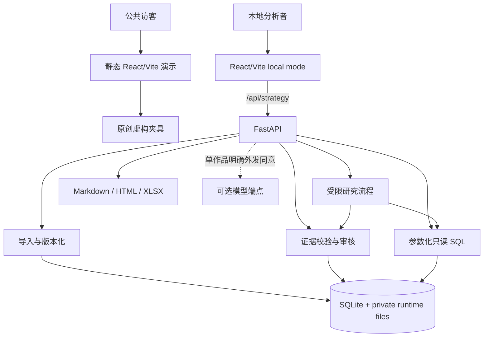
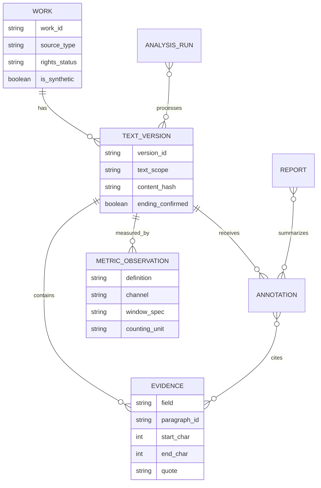
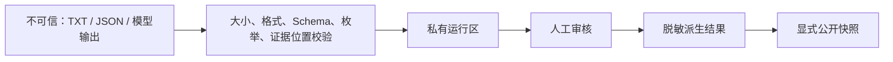

# HerLens 架构与数据流

HerLens 有两个刻意分离的运行模式：公共只读演示用于稳定展示产品决策；本地 API 模式用于有权文本的导入、修订、确定性分析与导出。模型端点是可选依赖，不是公共演示的单点故障。

运行模式和业务契约都不按小说篇幅分叉。`text_scope` 决定当前可以回答什么，而章节识别、有界分块、作品级聚合和资源上限决定多章节作品如何执行。结构分块通过不等于全书语义分析已通过，后者还需覆盖、聚合和人工证据审核。

## 系统上下文



## 模式对比

| 能力 | `readonly` | `local` |
| --- | --- | --- |
| 数据源 | 仓库内明确标注的虚构夹具 | 夹具或用户明确授权的本地文本 |
| 登录 / Key | 不需要 | 实时模型调用时才需要服务端 Key |
| 写操作 | 不持久化；用于界面回放 | 通过本地 FastAPI 修订、重算与导出 |
| 模型网络 | 禁用 | 默认未配置；需服务端配置且作品 `modelConsent=true` |
| 适合场景 | GitHub Pages、简历链接、离线演示 | 个人私有复盘与现场操作 |

## 固定业务流


流程不是自由行动的多 Agent 系统。研究阶段最多六次工具动作，只使用受限结构参数：

1. `inspect_dataset`：先查范围、缺失、权限和可比性。
2. `select_cohort`：冻结样本与排除原因。
3. `aggregate_features`：对作品—标签去重后统计。
4. `compare_metrics`：只比较合格口径；不合格时返回拒绝原因。
5. `get_evidence`：返回版本化原句及审核状态。
6. `draft_memo`：只从已有查询和证据引用组装最多三条发现。

程序不向研究控制器暴露任意 shell、Python、SQL 写入或 URL 抓取工具。

## 主要数据实体



`metadata_only / opening_only / full_text` 决定哪些判断可用。只有 `full_text` 且 `ending_confirmed=true` 时才可作最终兑现判断。

## 指标可比性

CTR 只在同一 `metric_definition_id/definition`、`channel`、`window_spec`、`counting_unit`且可连接到同一标题版本时计算：

```text
weighted_ctr = sum(clicks) / sum(impressions)
```

额外约束：

- 曝光为零或缺失时，分母无效，不使用阅读量代替。
- 只有平台展示百分比时保留 `ctr_reported`，不反推点击或曝光。
- 累计快照不求和；重叠时间区间不合并。
- 多标签连接前先按作品版本去重，避免指标被成倍复制。
- 真实与虚构 cohort 不混合研究。

## API 边界

业务路由使用 `/api/strategy`独立前缀。关键端点是：

- `GET /state` 和 `GET /health`：只返回必要的模式、状态和 Schema 版本，不返回 Key。
- `POST /datasets/import`：逐行返回 `imported / duplicate / error`，不静默丢弃。
- `POST /runs` 与 `GET /runs/{id}`：支持幂等键、阶段状态、失败保留与中断恢复。
- `PATCH /annotations/{id}`：带预期修订号；冲突返回 409，无效证据返回 422，并使派生报告过期。
- `POST /comparisons` 和 `POST /research-runs`：只接受白名单字段。
- `GET /reports/{id}` 和 `/export`：过期报告不得装作当前版本；过期导出被拒绝。

完整形状见 [`UPGRADE_CONTRACT.md`](./UPGRADE_CONTRACT.md)。

## 信任边界和故障处理



- 无效模型 JSON 最多进行有限次修复；仍失败则持久化错误，不用空对象假装成功。
- 单篇失败不删除其他作品结果；恢复不应重复计数。
- 密钥只位于本地服务端环境，不进入浏览器、SQLite、日志、trace 或导出。
- 上传权、本地处理权、发送模型服务权和公开展示权分别记录。

## 关键设计决策

- [ADR-0001：保留 React/Vite 前端，增加独立 FastAPI 后端](./adr/0001-react-fastapi-boundary.md)
- [上游快照与复用决策](./UPSTREAM_REVIEW.md)
- [局限与下一道门](./LIMITATIONS_AND_NEXT_GATES.md)
