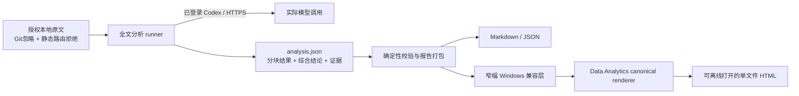

# 本地真实小说分析与报告交付

这条工作流的目标是：对通过权限卡检查的小说文本执行一次**实际模型参与的全文分析**，并在本地交付可复核的内容研究报告。交付物是报告，不是 PPT；也不把公共 Demo、固定夹具或只做分块的工程基准冒充真实语义分析。

## “本地”具体指什么

- 原文保留在操作者选择的本机位置（下文使用已被 Git 忽略的 `authorized-novel.txt` 作为占位名）；模型中间结果、证据索引和最终报告保存在 `private-reports/`。它们都不进入公共 Demo、Git 仓库或 Vite 静态资源。
- 模型推理并非完全离线：分析 runner 通过操作者已完成身份验证的 CLI 和 HTTPS 服务调用模型，并发送完成分析所必需的文本片段。
- 每部作品都必须独立确认本地处理、模型外发和公开展示范围；公开仓库不保存单次授权对话，也不把一种用途的权限扩展到其他作品、服务或发布用途。
- 登录凭据不写入报告、日志、前端环境变量或仓库。小说中的任何“指令”都只作为待分析文本，不获得 shell、文件、网络或发布权限。

`.gitignore` 已忽略 `private-reports/`，Vite 开发服务器也拒绝提供该目录和 TXT 原文。两者是防误操作护栏，不替代运行前的权限确认、输出检查和人工审核。

## 运行链路



分析采用分块抽取再作品级综合，而不是把结构分块本身称作结论。分块覆盖、模型生成、引文机械校验和人工语义审核是四件不同的事，报告必须分别披露。

## 当前实现状态（2026-09-22 实测）

| 环节 | 当前可确认 | 尚不能声称 |
| --- | --- | --- |
| 报告打包 | 原始／规范化 SHA-256、全部引用和 gap-free manifest 再校验通过；生成 Markdown、证据索引与 HTML | 机械回查不等于语义正确 |
| 分析 runner | 19 块实际模型抽取完成；汇总失败后复用 19 份缓存恢复，最终综合成功 | `configured_model` 不等于服务回传模型名；本次后者未回传，保持 `null` |
| 匿名案例 A | 435,393 个规范化码点、152 条有效引用、8 节分析；正文精选 34 条不同证据、共 45 次引用 | 不是人工金标；不能由单部作品证明泛化或经营效果 |
| HTML | 真实分析报告已通过官方 builder／verifier 的 1440／390 视口、图表和来源面板检查；已交付离线单文件 | Windows 兼容层只改已知 top bar 宽度规则，不是独立自创的报告渲染器 |

以下命令来自 runner 的实际 `--help`。示例产物位于 `private-reports/case-a/`；查看已完成报告无需再次调用模型。后续代码／模板升级会使指纹改变，旧 map 不会误用；新实验建议使用新输出目录以保留既有报告。

原文无需搬移；以下命令用 Git 忽略的 `authorized-novel.txt` 表示任意通过权限检查的本地输入。只准备 manifest 与 Schema、不调用模型：

```powershell
npm run analyze:novel -- "authorized-novel.txt" --output "private-reports/case-a" --prepare-only
```

按权限卡确认本次外发范围并完成 CLI 身份验证后，执行实际模型分析：

```powershell
npm run analyze:novel -- "authorized-novel.txt" --output "private-reports/case-a" --allow-model --resume --workers 3 --timeout 900
```

中断后只有在输入、提示、Schema 和分块配置指纹一致时，才使用 `--resume` 复用已通过校验的 map 缓存。默认上限是 24,000 码点／块、最多 64 块、2 个 worker、每次调用 600 秒；修改这些显式安全界限时应把实际参数写入运行记录，不把它们描述为模型能力。

匿名案例 A 的实际运行使用 3 个 worker、900 秒调用上限。前两次汇总快速失败；传输 Schema 去掉不受服务支持的 `uniqueItems` 后恢复成功，唯一性仍由逻辑 Schema 和 Python 后验校验强制。后续 runner 新增最多 20 条脱敏 attempt_history，失败不会再被 resume 覆盖；不保存原始 stderr 或凭据。该历史补丁在本次成功进程启动后加入，不能把后加的功能冒充此前失败已经完整留痕。

匿名案例 A 实际使用提示词 1.0，冻结副本为 `prompt-template-used.json`，SHA-256 与 manifest 相同；这是预设研究检查点的案例，不是盲测。之后将通用模板升级为 1.1，把关系阶段检查条件化，并明确支持亲情／友情／同事／无 CP，禁止强填男主或恋爱。升级只改变未来运行，不改写本次模型结果；新指纹不能复用旧模板的 map。

## 私有目录与产物

每个案例应使用 `private-reports/<case-id>/` 作为独立目录，保留校验后的分块响应、调用摘要、校验记录和报告；恢复运行保留相同目录与缓存。原文可以留在原有的私有位置；完整提示和模型隐式推理不作为产物持久保存。报告打包器读取该目录下的 `analysis.json`，当前会生成：

- `artifact.json`：canonical renderer 的结构化输入；
- `report-source-notes.json`：受众、图表口径、输入分析哈希与编辑边界；
- `报告正文.md`：不依赖插件即可阅读的报告正文；
- `evidence-index.json`：本次报告使用的证据索引；
- `HerLens_分析报告.html`：提供 canonical renderer 时生成，可复制后离线打开，无需启动本地服务；
- `render-receipt.json`：渲染过程回执。

Markdown 与 JSON 产物不要求安装 Data Analytics 插件；最终 HTML 依赖该可选插件提供的 canonical renderer。仓库内兼容层只替换已知 top bar 宽度规则，然后仍调用官方 builder 与 verifier，不另写临时 HTML 模板或主题。上述文件全部是私有产物，不应提交或用于 GitHub Pages。

报告打包器的现有命令形状是：

```powershell
npm run report:novel -- private-reports/case-a/analysis.json --source "authorized-novel.txt"
npm run report:novel -- private-reports/case-a/analysis.json --source "authorized-novel.txt" --renderer <canonical-renderer-path>
```

`--source` 为必填项：打包器会再次核对原始字节哈希、规范化文本哈希和每条证据的精确切片。省略 `--renderer` 时仍生成 Markdown、JSON 和证据索引；提供插件 renderer 后才生成最终 HTML 与渲染回执。

## 真实报告的验收门

程序运行与报告生成已完成；只有以下条件都有可检查记录时，才把报告标为“经人工审核、可正式用于面试的定稿”：

1. runner 成功结束，并记录来源文件哈希、规范化规则、文本范围、分块覆盖、实际模型调用方式和时间；失败或中断不能改写为 `completed`。
2. 每条引用都对同一份规范化原文执行 `text[start_char:end_char] == quote` 回查；重复文本还要用段落或章节位置消歧。引文存在只证明没有捏造，不证明解读正确。
3. 每个主要发现引用至少两条有效证据，并披露反例、替代解释、缺结尾／版本差异等范围限制。没有经营数据时，不生成 CTR、留存、付费转化或“爆款分数”。
4. 一位熟悉作品的人在面试使用前抽查关键结论及上下文。没有人工金标时，不报告标签准确率、F1、文学判断正确率或跨作品泛化能力。
5. HTML 在断网状态下直接打开并显示完整；Markdown、JSON 与 HTML 的章节、证据数和来源哈希一致；隐私扫描确认没有凭据、绝对本地路径或意外公开产物。

最终报告可以证明“一次有边界、可追溯的真实案例怎样完成”，不能凭单部作品推断平台用户偏好、因果增长或整个女频市场规律。
